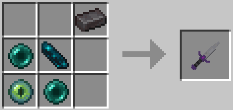
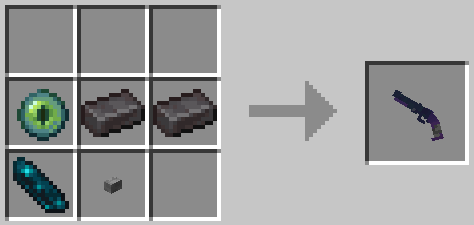

# Soul Of Night
ちゅずめ氏のデータパック作品 [**Sword of Night**](https://www.youtube.com/watch?v=i-ItAsrIK7U&t=1s) を(勝手に)改造したもの。  
何かしら「事情」が発生したら公開を止めます。  

## 追加されるアイテム
### Sword of Night  

#### スタブ
立って右クリックを長押しすると、剣を振り上げる。音が鳴ったら振り上げきった合図。  
振り上げきってからモブの背後で右クリックを放すとバックスタブをする。  
※振り上げ状態では、バックスタブの対象の目安として、対象となるモブの足元にエフェクトが表示される。  

#### テレポート
このアイテムを持ってしゃがむとテレポート待機状態に入る。  
- バックテレポート  
この状態でモブを見ながら右クリックすると、そのモブの背後にテレポートする。この直後は振り上げが速くなる。  
- ポータル  
真下を向きながらしゃがんで右クリックをすると、ポータルを使用する。  
その場にポータルを設置し、設置状態でもう一度同じ動作をするとポータルにテレポートする。

### Sawed off Night

